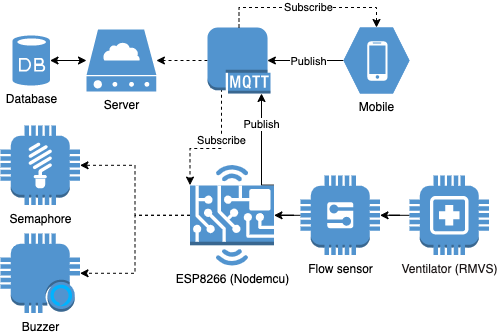

## COVID 19 Airflow Sensor (WORK IN PROGRESS)

This is a proof of concept of Rapidly Manufactured Ventilation System (RMVS) integrated with flow sensor and MQTT broker. The basic idea of this project is to integrate a flow sensor with an existing RMVS to collect the oxygen flow and send to an MQTT broker. This broker will persist the data and it will evaluate the flow based on the patient's profile to determine inconsistencies and thus generate alerts.

### Configurations

The project is separated in IOT and Server, so its important to you read the specific README files

- [IOT](./iot/README.md)
- [Server](./server/README.md)

# License

[MIT licensed](./LICENSE).
